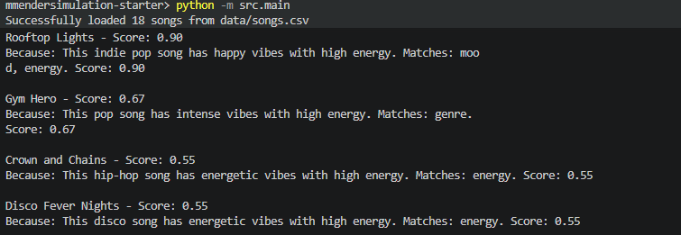

# 🎵 Music Recommender Simulation

## Project Summary

This music recommender system provides personalized song recommendations based on user taste profiles. 

**Key Features:**
- **Multi-user support**: Process recommendations for multiple users simultaneously
- **Weighted scoring algorithm**: Combines genre (35%), mood (25%), energy (25%), and acoustic (15%) preferences
- **Robust preference handling**: Gracefully handles missing or incomplete user preferences
- **Edge case testing**: Includes adversarial user profiles to validate scoring logic reliability

The system evaluates songs against user preferences and returns ranked recommendations with scoring explanations.

---

## How The System Works
According to cht these sytems user collaborative filtering(find similar users and recomend what they liked)  combined with content based filtering(recomending songs absed on what you've liked )
Audio features considered:Tempo, energy, valence , acousticness, dancabilty etc, meta data features, artists, genere release date popularity etc
machinelearning techniques used: Matrix factoriation, neural networks(fot turing complex nonlinear relationships), embeddings, recurrent neural networks (capture sequential patterns )

Explain your design in plain language.

Some prompts to answer:

- What features does each `Song` use in your system
  - For example: genre, mood, energy, tempo
- What information does your `UserProfile` store
- How does your `Recommender` compute a score for each song
- How do you choose which songs to recommend

You can include a simple diagram or bullet list if helpful.

---

I think musicl preference is defined by genre and mood. If I like certain gnre I would prefer to listen to it more and if I am in a certain mood I would prefer to listen to music  that suites that. 

copilot suggested that the most useful features to create a recommendationsytesm off of are Genre, mood, energy danceability and accousticness.

Mapping the logic
(a) if dancebility is  > 0.6 = high energy song
(b) if danceability is <  0.6  low energy song


copilot:
(a) take songs numeric features and calculate their score as : 
method 1: score = 1 - (|song_value - user_preference| / max_range)
method 2: score = exp(-(distance²) / (2 × variance))
(b)combines scores for  multiple features: 
total_score = w₁ × score_energy + w₂ × score_danceability + w₃ × score_acousticness +...


Algorithm recipe:
Step1:Scoring rule - score the songs against the user
input: one song + user profile
output: score between 0.0 and 1.0(higher = better match)
Scoring formula: FINAL_SCORE = (0.35 × genre_match) + (0.25 × mood_match) + (0.25 × energy_match) + (0.15 × acoustic_match)

Genre Match (35% weight)
If song.genre == user.favorite_genre → score = 1.0
If song.genre is similar style (pop ≈ indie-pop) → score = 0.7
Otherwise → score = 0.0
Mood Match (25% weight)
If song.mood == user.favorite_mood → score = 1.0
If song.mood is adjacent (happy ≈ energetic) → score = 0.6
Otherwise → score = 0.0
Energy Match (25% weight)

Step2 : Ranking rule
input: all songs with their scores
output: Top-k songs sorted by quality




Recomendation logic: 
Humans decide based on music theory and recommendation intuition.

Rationale:

Genre (35%): Most important—defines music type entirely
Mood (25%): Second most—emotional match is key experience
Energy (25%): Tightly tied to mood; sets activation level
Acoustic (10%): Affects tone but less critical
Valence (5%): Redundant with mood; lowest priority
Pros: Intuitive, requires


Note on biases:
The algorithm will prioritize genre and mood ignoring features such as acoustic ness and danceability

---

## Testing & Edge Cases

To validate the scoring algorithm's robustness, the system includes **8 adversarial and edge case user profiles** designed to reveal potential issues:

| Test Profile | Edge Case | Purpose |
|--------------|-----------|---------|
| Contradictory Bob | High energy + chill mood | Tests handling of conflicting preference signals |
| Neutral Nancy | All middle-ground values | Validates neutral preference ranking |
| Maximalist Max / Minimalist Min | Boundary values (1.0 / 0.0) | Ensures scoring doesn't break at extremes |
| Obscure Ollie | Niche/non-existent genre | Tests graceful handling of unknown genres |
| Minimal Mike | Missing energy field | Validates robustness with incomplete data |
| Mismatched Mary | Metal genre + relaxed mood | Tests feature dominance when preferences conflict |
| Acoustic Alex | Extreme acoustic preference | Evaluates acoustic weighting impact |

**Bug Fix:** The scoring function now handles missing `energy` preferences by defaulting to 0.5 (neutral), making the system more resilient to incomplete user profiles.


## Getting Started

### Setup

1. Create a virtual environment (optional but recommended):

   ```bash
   python -m venv .venv
   source .venv/bin/activate      # Mac or Linux
   .venv\Scripts\activate         # Windows

2. Install dependencies

```bash
pip install -r requirements.txt
```

3. Run the app:

```bash
python -m src.main
```

This will generate recommendations for 12 users (including 4 standard profiles and 8 edge case profiles). Each user's recommendations are displayed with:
- User preferences summary
- Top 5 recommended songs
- Match scores (0.0-1.0)
- Explanation for each recommendation

### Running Tests

Run the starter tests with:

```bash
pytest
```

You can add more tests in `tests/test_recommender.py`.

---

## Experiments You Tried

Use this section to document the experiments you ran. For example:

- What happened when you changed the weight on genre from 2.0 to 0.5
- What happened when you added tempo or valence to the score
- How did your system behave for different types of users

---

## Limitations and Risks

Summarize some limitations of your recommender.

Examples:

- It only works on a tiny catalog
- It does not understand lyrics or language
- It might over favor one genre or mood

You will go deeper on this in your model card.

---

## Reflection

Read and complete `model_card.md`:

[**Model Card**](model_card.md)

Write 1 to 2 paragraphs here about what you learned:

- about how recommenders turn data into predictions
- about where bias or unfairness could show up in systems like this


---

## 7. `model_card_template.md`

Combines reflection and model card framing from the Module 3 guidance. :contentReference[oaicite:2]{index=2}  

```markdown
# 🎧 Model Card - Music Recommender Simulation

## 1. Model Name

Give your recommender a name, for example:

> VibeFinder 1.0

---

## 2. Intended Use

- What is this system trying to do
- Who is it for

Example:

> This model suggests 3 to 5 songs from a small catalog based on a user's preferred genre, mood, and energy level. It is for classroom exploration only, not for real users.

---

## 3. How It Works (Short Explanation)

Describe your scoring logic in plain language.

- What features of each song does it consider
- What information about the user does it use
- How does it turn those into a number

Try to avoid code in this section, treat it like an explanation to a non programmer.

---

## 4. Data

Describe your dataset.

- How many songs are in `data/songs.csv`
- Did you add or remove any songs
- What kinds of genres or moods are represented
- Whose taste does this data mostly reflect

---

## 5. Strengths

Where does your recommender work well

You can think about:
- Situations where the top results "felt right"
- Particular user profiles it served well
- Simplicity or transparency benefits

---

## 6. Limitations and Bias

Where does your recommender struggle

Some prompts:
- Does it ignore some genres or moods
- Does it treat all users as if they have the same taste shape
- Is it biased toward high energy or one genre by default
- How could this be unfair if used in a real product

---

## 7. Evaluation

How did you check your system

Examples:
- You tried multiple user profiles and wrote down whether the results matched your expectations
- You compared your simulation to what a real app like Spotify or YouTube tends to recommend
- You wrote tests for your scoring logic

You do not need a numeric metric, but if you used one, explain what it measures.

---

## 8. Future Work

If you had more time, how would you improve this recommender

Examples:

- Add support for multiple users and "group vibe" recommendations
- Balance diversity of songs instead of always picking the closest match
- Use more features, like tempo ranges or lyric themes

---

## 9. Personal Reflection

A few sentences about what you learned:

- What surprised you about how your system behaved
- How did building this change how you think about real music recommenders
- Where do you think human judgment still matters, even if the model seems "smart"

